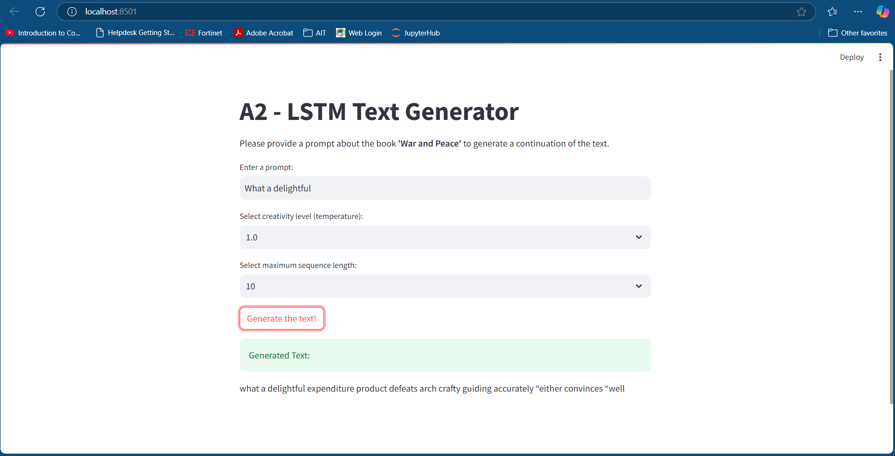
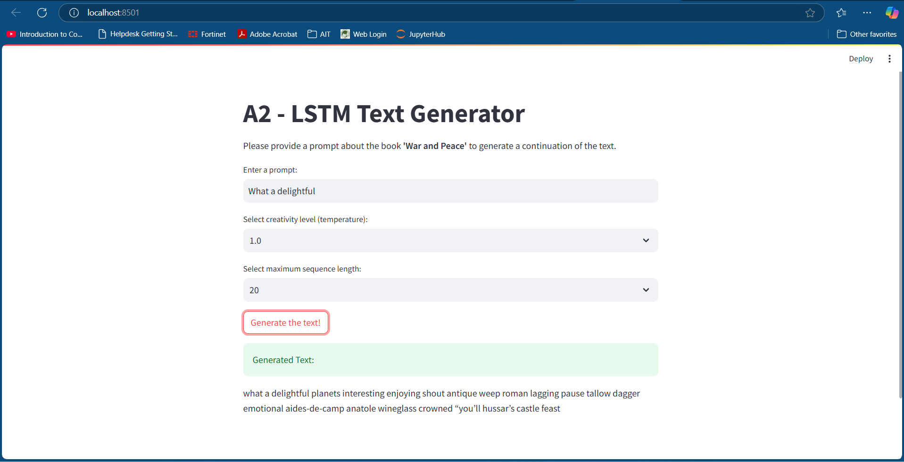
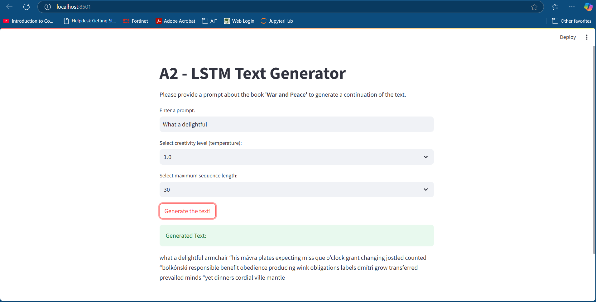

# A2 - LSTM Text Generator

- [Student Information](#student-information)
- [Overview](#overview)
- [Dataset](#dataset)
- [Model Architecture](#model-architecture)
- [Hyperparameters](#hyperparameters)
- [Training Process](#training-process)
- [Testing Results](#testing-results)
- [Features](#features)
- [Installation](#installation)
- [Running the Project](#running-the-project)
- [Example Outputs](#example-outputs)
- [Credits](#credits)

## Student Information
- Name : Phue Pwint Thwe
- ID : st124784

## Overview
This project implements an LSTM-based text generator trained on War and Peace by Leo Tolstoy. The goal is to produce coherent and contextually relevant text continuations for given prompts. A Streamlit-based web application is included for user interaction with the model.

## Dataset
The dataset used is the text of *War and Peace*. You can download it from a public source(https://www.gutenberg.org/ebooks/search/?query=war+and+peace&submit_search=Go%21). The dataset was processed and split as follows:
- Training Set: 52,829 rows (80%)
- Validation Set: 6,604 rows (10%)
- Test Set: 6,604 rows (10%)
The text was cleaned by removing unwanted characters and split into sequences of length 50 for training the model. Text is tokenized using the basic_english tokenizer from torchtext. Vocabulary is built using torchtext.vocab.build_vocab_from_iterator. Special tokens like <unk> and <eos> are added.

## Model Architecture
The LSTM Language Model is a sequential text generation model. Its most critical components are:

- Embedding Layer: Converts tokens into dense vector representations.
- LSTM Layers: Two-layer LSTM with 1024 hidden units to capture sequential dependencies.
- Dropout: Applied to avoid overfitting.
- Fully Connected Layer: Maps hidden states to vocabulary predictions.

## Hyperparameters
- Vocabulary Size: Derived from the dataset vocabulary.
- Embedding Dimension: 1024
- Hidden Dimension: 1024
- Number of Layers: 2
- Dropout Rate: 0.65
- Learning Rate: 1e-3
- Sequence Length: 50
- Epochs: 100
- Gradient Clipping: 0.25

## Training Process
The model was trained for 100 epochs using the Adam optimizer and a learning rate scheduler to reduce learning rate by a factor of 0.5 if validation loss plateaued. The training process included:
1. Training Loss: Monitored and minimized using cross-entropy loss. 
2. Validation Loss: Used to evaluate the model during training.
3. Saving the Best Model: The model with the lowest validation loss was saved.

## Testing Result
The best model was evaluated on the test set, achieving a Test Perplexity of 115.468. While the results demonstrate the model's ability to generate coherent text, there is room for improvement, particularly in generating longer sequences.

## Features
1. **Train an LSTM Model:**
   - Processes text data to create a language model.
   - Learns to generate text based on a given prompt.
2. **Interactive Web Application:**
   - Users can input prompts, adjust creativity level (temperature), and specify the length of generated text.
   - Outputs the generated text in real-time.

## Installation

1. **Clone the Repository:**
   ```bash
   git clone <repository_link>
   cd <repository_directory>
   ```

2. **Install Dependencies:**
   Make sure you have Python 3.7 or above installed. Install the required packages using:
   ```bash
   pip install -r requirements.txt
   ```

## Running the Project

### Train the Model
The Jupyter notebook provided contains the code for training the LSTM model. To train:
1. Open the notebook (`A2_LSTM_Text_Generator.ipynb`).
2. Run all cells to preprocess the dataset and train the model.
3. The trained model will be saved as ./app/models/best-val-lstm_lm.pt.

### Run the Web Application
To launch the Streamlit web application:
1. Ensure the trained model is saved in the appropriate directory.
2. Run the following command in the terminal:
   ```bash
   streamlit run app.py
   ```
3. Open `localhost:8501` in your web browser to access the application.

## Web Application Features
1. **Prompt Input:**
   - Enter a text prompt (e.g., "What a delightful").
2. **Adjustable Parameters:**
   - Select creativity level (temperature).
   - Choose the length of the generated text.
3. **Real-time Text Generation:**
   - View the generated continuation of your prompt.

## File Structure
- `A2_LSTM_Text_Generator.ipynb`: Notebook for training the LSTM model.
- `app.py`: Code for the web application.
- `requirements.txt`: List of dependencies.
- `war_and_peace.txt`: Sample dataset.

## Example Outputs
### Prompt: "What a delightful"
The outputs were tested through three different sequence lengths but with the same temperature value. This demonstrates the model's ability to extend the input prompt and generate text with varying levels of detail and complexity:
1. **Output 1 (Short Sequence)**:
   - *"What a delightful expenditure product defeats arch crafty guiding accurately either convinces well."*
   - This output is concise, maintaining a simple structure with a few descriptive terms. The grammar and coherence are acceptable but may benefit from further context. 
2. **Output 2 (Medium Sequence)**:
   - *"What a delightful planets interesting enjoying shout antique weep roman lagging pause tallow dagger emotional aides-de-camp Anatole wineglass crowned you'll hussar's castle feast."*
   - This medium-length sequence introduces more diverse vocabulary. It combines random descriptive elements but starts to lose grammatical coherence toward the end. 
3. **Output 3 (Long Sequence)**:
   - *"What a delightful armchair his mavra plates expecting miss que o'clock grant changing jostled counted bolkonski responsible benefit obedience producing wink obligations labels dmi'tri grow transferred prevailed minds yet dinners cordial ville mantle."*
   - The longest sequence demonstrates the model's capacity to generate extended text. However, the output becomes increasingly fragmented, introducing unrelated terms and losing coherence as it progresses. This indicates room for improvement in handling longer sequences. 


## Credits
- Dataset: *War and Peace* by Leo Tolstoy.
- Frameworks: PyTorch, Streamlit, and HuggingFace's `datasets` library.

---